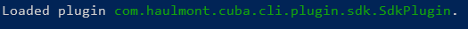

# CUBA SDK

# 1. Overview 

The CUBA SDK is a plugin for [CUBA CLI](https://github.com/cuba-platform/cuba-cli). This is a command line tool which provides an ability to resolve and export all dependencies for CUBA framework, add-ons or any external library and then use SDK as embedded repository. 
All resolved dependencies will be stored in local SDK maven repository. This tool has built-in [Nexus 3 repository](https://www.sonatype.com/nexus-repository-oss). 

# 2. Installation 

CUBA CLI and SDK compatibility

| CUBA CLI Version | SDK Version    |
|------------------|----------------|
| 2.1.0            | 0.1-SNAPSHOT   |  

## Manual installation from sources

1. Install compatible CUBA CLI tool
2. Checkout CUBA  SDK sources from [GitHub](https://github.com/cuba-platform/cuba-sdk)
3. Run `installPlugin` gradle task
4. Run `cuba-cli` from command line 

If SDK plugin was loaded successfully then following message will be displayed in command line

# 3. Configuration 

To configure SDK please run `sdk init` command. Before first usage SDK should be configured. 

# 4. Commands reference 

## 4.1. Common SDK commands 

- `sdk` - prints current SDK status
- `sdk properties` - prints configured SDK properties. Specific properties can be printed with `--n` or `--name` additional parameters, for example `sdk properties --n sdk.export.path`
- `sdk init` - init SDK. This command will configure SDK properties and download, install and configure *Gradle*. For already configured SDK this command will not cleanup current SDK metadata
- `sdk setup-nexus` - setup embedded Nexus repository. This command will download, install and configure Nexus repository.
- `sdk cleanup` - cleanup SDK metadata and remove all artifacts from local *m2* repository and from embedded Nexus repository. If `--local-only` flag provided then only local *m2* repository will be cleaned
- `sdk set-license` - set license key and configure Premium repositories for *source* repository 
- `sdk check-updates` - check available minor updates for framework and add-ons.  Specific target repository can be configured with `--r` or `--repository` additional parameters, example `sdk import --r sdk2`. If `--no-upload` additional parameter presented then SDK archive will be imported to local *m2* repository only.

## 4.2. Embedded nexus repository commands 

- `sdk start` - start embedded repository
- `sdk stop` - stop embedded repository 

## 4.3 Manage repositories 

SDK tool has three repository scopes:
- **search** - repository to search components for frameworks and add-ons 
- **source** - source repository for maven commands. Dependencies will be downloaded from these repositories  
- **sdk** - target repository to upload components with dependencies

By default following repositories are configured:
- **search scope:**
  - local m2 repository
  - CUBA Bintray
  - CUBA Nexus
- **source scope:**
  - local m2 repository
  - CUBA Bintray
  - CUBA Nexus   
- **sdk scope:**
  - repository configured in `setup` command 
    
**Commands:**
- `sdk repository list` - print list of configured repositories
- `sdk repository list sdk` - print list of configured sdk repositories
- `sdk repository list source` - print list of configured source repositories
- `sdk repository list search` - print list of configured search repositories

- `sdk repository add` - configure new repository
- `sdk repository add sdk` - configure new sdk repository
- `sdk repository add source` - configure new source repository
- `sdk repository add search` - configure new search repository

- `sdk repository remove` - remove repository
- `sdk repository remove sdk` - remove sdk repository
- `sdk repository remove source` - remove source repository
- `sdk repository remove search` - remove search repository

## 4.4. Manage components 

### Component commands 

List command will print list of resolved and installed components:
- `sdk list framework`
- `sdk list addon`
- `sdk list lib`

Component coordinates for framework ad add-on component commands can be configured as
- `empty` - ask which framework or addon should be installed. User able to select name and version from list
- `<name>` - search component by *name* and select version from versions list
- `<name>:<version>` - search component by *name* and run command for component for configured version
- `<group>:<name>:<version>` - run command for component by full component coordinates

Example: `sdk push framework cuba:7.1.3`
 
Resolve command will find and download all component dependencies to local *m2* repository. If add-on depends on other add-ons then SDK will ask to resolve additional add-ons too, this feature can be disabled with `--nra` or `--not-resolve-addons` additional parameters 
- `sdk resolve framework`
- `sdk resolve addon`
- `sdk resolve lib`

Push command will upload resolved components with dependencies to all *target* repositories. Specific target repository can be configured with `--r` or `--repository` additional parameters, example `sdk push addon dashboard --r sdk2`.  
- `sdk push framework`
- `sdk push addon <name>`
- `sdk push lib`

Install command will resolve and push components. Specific target repository can be configured with `--r` or `--repository` additional parameters, example `sdk push addon dashboard --r sdk2`.  
- `sdk install framework`
- `sdk install addon`
- `sdk install lib`

Remove command will remove component with dependencies from local *m2* repository and from embedded Nexus repository. If `--local-only` flag provided then component will be removed from local *m2* repository only.  
- `sdk remove framework`
- `sdk remove addon`
- `sdk remove lib`

Export command will export component with dependencies as archive to `sdkproperties[sdk.export.home]` directory. If component is not resolved yet then SDK will ask to resolve component  
- `sdk export` - export all resolved SDK components
- `sdk export framework`
- `sdk export addon`
- `sdk export lib`
    
Import command will import exported SDK archive to current SDK and upload it to *sdk* repositories. Specific target repository can be configured with `--r` or `--repository` additional parameters, example `sdk import --r sdk2`. If `--no-upload` additional parameter presented then SDK archive will be imported to local *m2* repository only.
- `sdk import <file path>` 

### Additional parameters which can be applied to components commands:
- `--f` or `--force` - resolve and upload component with dependencies even if component already resolved or installed
- `--single` - run command in single thread mode
- `--info` - print Gradle output. Please note that in this case command will be executed in single thread mode
- `--go` or `--gradle-option` - additional Gradle execution options

# 5. SDK settings 

Configured SDK settings by default are located in `<User.home>/cli/sdk/sdk.properties` file. Current configured settings can be printed with `sdk properties` command

### Properties reference:

*default SDK target repository which was configured in `setup` command*
- `repository.type` - type of configured repository, can be `local` or `remote`
- `repository.url` - repository url, for embedded nexus this property will point to nexus Web UI
- `repository.name` - repository name
- `repository.path` - path where installed embedded nexus repository
- `repository.login` repository user login
- `repository.password` repository user password

*SDK metadata*
- `sdk.home` - default SDK home directory
- `sdk.export` - path to directory to save exported SDK archives

*Maven settings*
- `maven.local.repo` - local *m2* repository folder path
- `maven.settings` - generated maven settings file path
- `maven.path` - installed maven path

### Apply custom SDK settings

Following parameters can be applied to all `sdk` commands
- `--s` or `--settings` - path to custom settings file. All settings from this file will override default setting properties. This feature can be useful to create SDK profiles.
- `--sp` or `--setting-property` override default setting parameter, for example `--sp maven.local.repo=/home/user/other-m2`

