<p>
<a href="http://www.apache.org/licenses/LICENSE-2.0"></a>
</p>

# CUBA SDK

- [Overview](#overview) 
- [Installation](#installation)
- [Commands Reference](#commands-reference)
  - [Common SDK Commands](#common-sdk-commands)
  - [Embedded Nexus Repository Commands](#embedded-nexus-repository-commands)
  - [Manage Repositories](#manage-repositories)
  - [Manage Components](#manage-components)
- [SDK Settings](#sdk-settings)
- [Plugins](#plugins)
- [Guides](#guides)
  - [How to Organize Local Repository](#how-to-organize-local-repository)
  - [How to Export Artifacts](#how-to-export-artifacts)
  - [How to Import Artifacts](#how-to-import-artifacts)
  - [Build Information](#build-information)
    - [How to build, run, and debug CUBA SDK locally (in Intellij IDEA)](#how-to-build-cuba-sdk)
    - [How to build DMG image](#how-to-build-dmg-image)

# Overview <a name="overview"></a>

CUBA SDK is a command-line tool that provides an ability to resolve, export and upload to an external repository all dependencies 
for CUBA and Jmix frameworks, add-ons or any external library with a few simple commands. SDK can be used as an embedded repository. This tool has a built-in [Nexus 3 repository](https://www.sonatype.com/nexus-repository-oss). 

CUBA SDK is a useful tool if it is required to develop applications with a limited network environment. 


### Main CUBA SDK features

- IDE-Agnostic command-line tool.
- Can be installed on CI server.
- Automatically collects and resolves all artifact dependencies.
- Automatically downloads and resolves artifact sources. 
- User-friendly command-line interface.
- Supports external plugins.
- Uses Gradle to resolve artifact dependencies.
- Checks for new artifacts versions and can install them automatically with all dependencies.
- Can work with several source and target repositories.
- Supports local `m2` repository as a source or target repository.
- Can install and setup an embedded Nexus OSS repository.
- Import/Export resolved artifacts with dependencies.
- Integrated with CUBA add-ons marketplace. 
- Supports different profiles for one CUBA SDK instance. 

# Installation <a name="installation"></a>

## Download and Install

- [Windows installer](https://github.com/cuba-platform/cuba-sdk/releases/download/1.2.8/cuba-sdk-1.2.8.exe)
- [Linux](https://github.com/cuba-platform/cuba-sdk/releases/download/1.2.8/cuba-sdk-1.2.8-linux.zip)
- [macOS](https://github.com/cuba-platform/cuba-sdk/releases/download/1.2.8/cuba-sdk-1.2.8.dmg)

### Windows

1. Download and run [Windows installer](https://github.com/cuba-platform/cuba-sdk/releases/download/1.2.8/cuba-sdk-1.2.8.exe). It will automatically register `cuba-sdk` in the PATH environment variable.
2. Open a terminal and run the `cuba-sdk` command.

### Linux

1. Download and unpack the [ZIP archive](https://github.com/cuba-platform/cuba-sdk/releases/download/1.2.8/cuba-sdk-1.2.8-linux.zip).
2. Add location of `cuba-sdk/bin` directory to the PATH environment variable.
3. Open a terminal and run the `cuba-sdk` command.

### macOS

1. Download and install [DMG](https://github.com/cuba-platform/cuba-sdk/releases/download/1.2.8/cuba-sdk-1.2.8.dmg).
2. Run CUBA SDK from Applications or add `/Applications/CUBA SDK.app/Contents/bin` to the PATH environment variable and run `cuba-sdk` in the terminal.

     The app is not signed at the moment, so macOS refuses to run it at the first attempt. You have to open *Preferences -> Security and Privacy* and click *Open Anyway*.

## Initialization

On the first run, SDK is automatically initialized. You can also do it at any time by running `init` command.

# Commands Reference <a name="commands-reference"></a>

## Common SDK Commands <a name="common-sdk-commands"></a>

- `sdk` - prints a current SDK status.
- `properties` - prints configured SDK properties. Specific properties can be printed with `--n` or `--name` additional parameters, for example,  `properties --n sdk.export.path`
- `init` - inits SDK. This command configures SDK properties and downloads, installs and configures *Gradle*. For the already configured SDK, this command does not clean up current SDK metadata.
- `sdk-home` - change current SDK home directory
- `setup-nexus` - sets up an embedded Nexus repository. This command downloads, installs and configures Nexus repository.
- `cleanup` - cleans up SDK metadata and removes all artifacts from the local *m2* repository and the embedded Nexus repository. If `--local-only` flag is provided, then only the local *m2* repository will be cleaned.
- `set-license` - sets the license key and configures Premium repositories for the *source* repository. 
- `check-updates` - checks available minor updates for framework and add-ons.  Specific target repository can be configured with `--r` or `--repository` additional parameters, for example, `import --r sdk2`. If `--no-upload` additional parameter is presented, then SDK archive will be imported only to the local *m2* repository.

## Embedded Nexus Repository Commands <a name="embedded-nexus-repository-commands"></a>

- `start` - starts embedded repository.
- `stop` - stops embedded repository. 

## Manage Repositories <a name="manage-repositories"></a>

SDK tool has three repository scopes:
- **source** - source repository for components. Dependencies will be downloaded from these repositories.  
- **target** - target repository to upload components with dependencies.

By default the following repositories are configured:
- **source scope:**
  - Local `m2`
  - Maven central
  - CUBA Nexus   
  - Jmix Nexus
- **target scope:**
  - repository configured in `setup` command 
    
**Commands:**
- `repository list` - prints list of configured repositories.
- `repository list target` - prints list of configured target repositories.
- `repository list source` - prints list of configured source repositories.

- `repository add` - configures new repository.
- `repository add target` - configures new target repository.
- `repository add source` - configures new source repository.

- `repository remove` - removes repository.
- `repository remove target` - removes target repository.
- `repository remove source` - removes source repository.

## Manage Components <a name="manage-components"></a>

### Component Commands 

List command prints a list of resolved and installed components:
- `list cuba`/`list jmix`
- `list cuba-addon`/`list jmix-addon`
- `list lib`

Component coordinates for framework and add-on component commands can be configured as:
- `empty` - asks which framework or add-on should be installed. User can select a name and version from the list.
- `<name>` - searches the component by *name* and select version from the versions list.
- `<name>:<version>` - searches component by *name* and runs command for the component for the configured version.
- `<group>:<name>:<version>` - runs command for the component by full component coordinates.

Example: `push cuba 7.1.3`
 
Resolve command finds and downloads all component dependencies to local Gradle cache. If an add-on depends on other add-ons, then SDK will ask to resolve additional add-ons too. This feature can be disabled with `--nra` or `--not-resolve-addons` additional parameters. 
- `resolve` - bulk command for the list of frameworks, add-ons, and libs.
- `resolve cuba`/`resolve jmix`
- `resolve cuba-addon`/`resolve jmix-addon`
- `resolve lib`

Push command uploads resolved components with dependencies to all *target* repositories. Specific target repository can be configured with `--r` or `--repository` additional parameters, for example, `push cuba-addon dashboard --r sdk2`.
- `push` - bulk command for the list of frameworks, add-ons, and libs.  
- `push cuba`/`push jmix`
- `push cuba-addon <name>`/`push jmix-addon <name>`
- `push lib`

Install command resolves and pushes components. Specific target repository can be configured with `--r` or `--repository` additional parameters, for example, `install cuba-addon dashboard --r sdk2`.
- `install` - bulk command for the list of frameworks, add-ons, and libs. 
- `install cuba`/`install jmix`
- `install cuba-addon`/`install jmix-addon`
- `install lib`

Remove command removes the component with dependencies from the local *m2* repository and the embedded Nexus repository. If `--local-only` flag is provided, then the component will be removed only from the local *m2* repository.  
- `remove cuba`/`remove jmix`
- `remove cuba-addon`/`remove jmix-addon`
- `remove lib`

Component coordinates for bulk commands can be passed with ','. For example: `install --c cuba>>7.2.1,cuba-addon>>dashboard:3.2.1`.

Export command exports the component with dependencies as an archive to the `sdkproperties[sdk.export.home]` directory. If the component is not resolved yet, then SDK will ask to resolve the component.  
- `export` - exports all resolved SDK components.
- `export cuba`/`export jmix`
- `export cuba-addon`/`export jmix-addon`
- `export lib`
    
Import command imports exported SDK archive to the current SDK and upload it to *sdk* repositories. Specific target repository can be configured with `--r` or `--repository` additional parameters, for example, `import --r sdk2`. If the `--no-upload` additional parameter is presented, then SDK archive will be imported only to the local *m2* repository.
- `import <file path>` 

### Additional Parameters which can be Applied to Components Commands:
- `--f` or `--force` - resolves and uploads the component with dependencies even if the component is already resolved or installed.
- `--single` - runs the command in the single-thread mode.
- `--info` - prints Gradle output. Please note, that in this case the command will be executed in the single-thread mode.
- `--o` or `--option` - additional Gradle execution options.

# SDK Settings <a name="sdk-settings"></a>

Configured SDK settings by default are located in the `<User.home>/cli/sdk/sdk.properties` file. Current configured settings can be printed with `properties` command.

### Properties Reference:

*Default SDK target repository which was configured in the `setup` command*
- `repository.type` - a type of the configured repository, can be `local` or `remote`.
- `repository.url` - repository URL, for embedded Nexus this property will point to nexus Web UI.
- `repository.name` - repository name.
- `repository.path` - path, where embedded Nexus repository is installed.
- `repository.login` -  repository user login.
- `repository.password` - repository user password.

*SDK metadata*
- `sdk.home` - default SDK home directory.
- `sdk.export` - path to the directory to save exported SDK archives.

*Local repo settings*
- `maven.local.repo` - local *m2* repository folder path. This folder using for components import.

*Gradle settings*
- `gradle.home` - gradle home folder
- `gradle.cache` - gradle cache folder
- `gradle.version` - gradle version

### Apply Custom SDK Settings

Following parameters can be applied to all commands:
- `--s` or `--settings` - path to the custom settings file. All settings from this file override the default setting properties. This feature can be useful to create SDK profiles.
- `--sp` or `--setting-property` override default setting parameter, for example `--sp maven.local.repo=/home/user/other-m2`.

# SDK Plugins <a name="plugins"></a>

CUBA SDK supports external plugins. Plugins are similar to [CUBA CLI](https://github.com/cuba-platform/cuba-cli) plugins. 
Please check more info about plugin development in [CUBA CLI documentation](https://github.com/cuba-platform/cuba-cli/wiki/Plugin-Development).

CUBA SDK plugins should be located in `<user.home>/.haulmont/sdk/plugins/` directory.

To add new component provider it is required to implement `com.haulmont.cuba.cli.plugin.sdk.templates.ComponentProvider` interface methods 
and add implementation to `ComponentRegistry` in `InitPluginEvent` plugin handler. 

Example:
```$java
private val componentRegistry: ComponentRegistry by sdkKodein.instance<ComponentRegistry>()

    @Subscribe
    fun onInit(event: InitPluginEvent) {
        componentRegistry.addProviders(YourProvider())
``` 

CUBA SDK provides additional events which can be used in external plugins:

- `SdkInitEvent` - fires after sdk was initiated
- `BeforeResolveEvent` - fires before component will be resolved, provides component which will be resolved
- `AfterResolveEvent` - fires after component was resolved, provides component which will be resolved
- `BeforePushEvent` - fires before component will be pushed to repository, provides component and repositories
- `AfterPushEvent` - fires after component was pushed to repository, provides component and repositories
- `BeforeRemoveEvent` - fires before component will be removed to repository, provides component
- `AfterRemoveEvent` - fires after component was removed to repository, provides component
- `NewVersionAvailableEvent` - fires when new component versions found in check versions command, provides component and new version
- `BeforeAddRepositoryEvent` - fires before repository will be added, provides repository
- `AfterAddRepositoryEvent` - fires after repository was added, provides repository
- `BeforeRemoveRepositoryEvent` - fires before repository will be removed, provides repository
- `AfterRemoveRepositoryEvent` - fires after repository was removed, provides repository

# Guides

## How to Organize Local Repository

As an example let's use the case when we need to download and push to the local repository CUBA and Dashboards add-on artifacts.

1. Install CUBA SDK according to the [Installation](#installation) section. After installation, you will see in the console:

  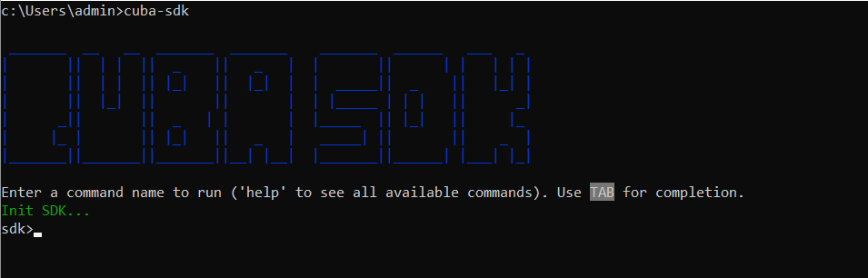

2. If you use CUBA SDK for the first time, configure SDK by running the `init` command. This command creates the necessary initial environment settings, downloads Gradle, and initializes the standard repositories.

  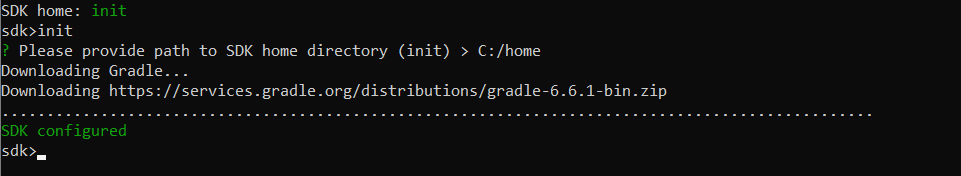

  Enter a path to the home directory. Pay attention, that you need to use `/` instead of `\` when entering a path.

  For the already configured SDK, the `init` command does not clean up current SDK metadata. To check the current SDK status, use the `sdk` command.

3. Use the `setup-nexus` command to install and configure a local Nexus OSS repository. We assume that we have access to the internet. Otherwise, please download correct nexus repository version from [https://www.sonatype.com/nexus-repository-oss](https://www.sonatype.com/nexus-repository-oss) and unzip the archive to the `nexus3` and `sonatype-work` folders in the SDK home directory. Then run `setup-nexus` command again.

  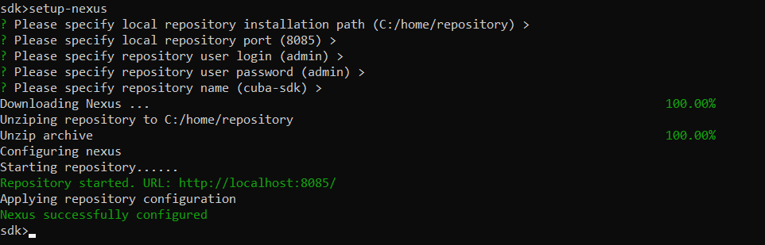

  By default, the repository can be accessed at `localhost:8085`.

  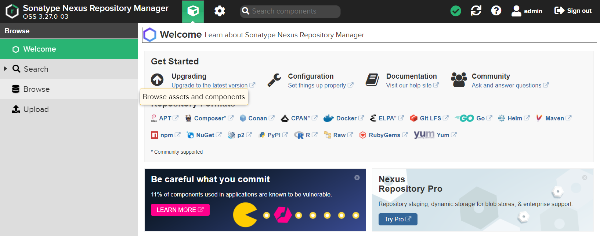

  To launch and stop the repository, use `start` and `stop` commands.

  The list of the repositories can be obtained by using the `repository list` command. In the example below, you can see the default repositories and the configured target repository.

  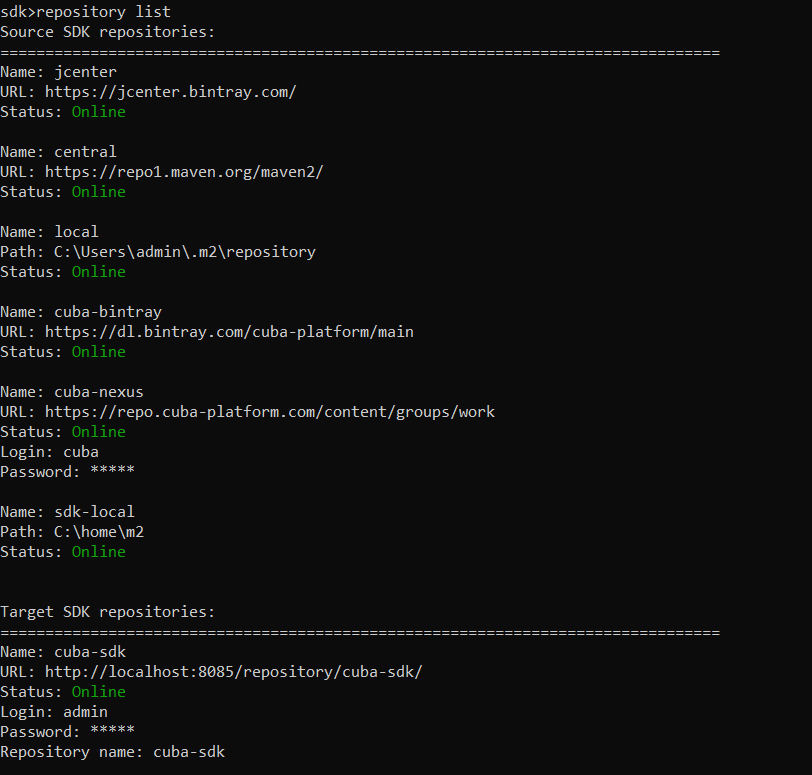

  The repository manager supports local and remote repositories which are divided into two groups within SDK:

  * source - repositories used for searching artifacts;
  * target - repositories to which the artifacts will be loaded.

4. To install CUBA to the local repository run the `install cuba` command. If the platform version is not specified, SDK provides available platform versions.

  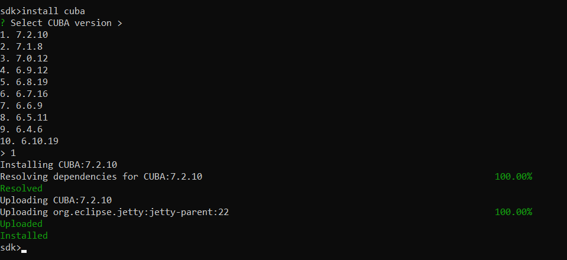

  This command resolves and pushes components to all target repositories.

5. To install an add-on, run the `install cuba-addon dashboard` command and select the version.

  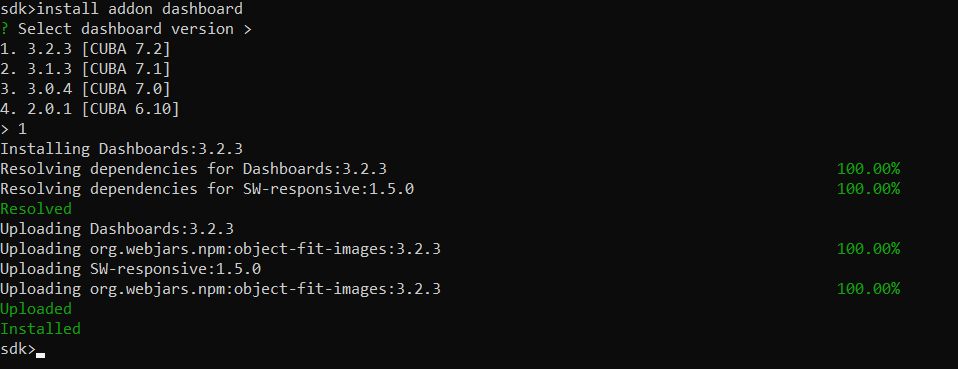

  Also, you can use the `install` command to select the necessary category.

  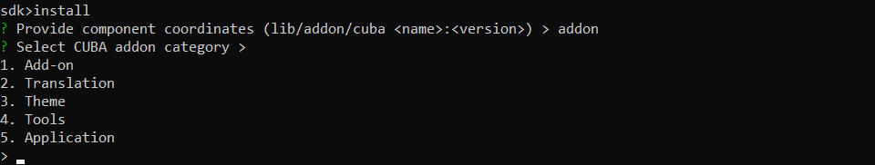

  If you need to install a premium add-on, set the license key by using the `set-license` command.

  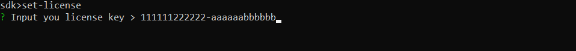

6. To grant access to the installed artifacts for your project, add the line with the repository into `build.gradle` file of your CUBA project.

```
buildscript {
    ext.cubaVersion = '7.2.10'
    repositories {
        maven {
            url 'http:/localhost:8085/repository/cuba-sdk'
            credentials {
            ...
            }
        }
        ...
    }
    dependencies {
        classpath "com.haulmont.gradle:cuba-plugin:$cubaVersion"
    }
}
```

The `credentials` section contains the `username` and `password` fields. Their values must be filled with the repository 
authentication data provided in the p. #3. By the way, [CUBA Plugin](https://plugins.jetbrains.com/plugin/7249-cuba) detects the embedded repository and provides the necessary 
information to the CUBA project `build.gradle` file.

**NB**: as Jmix projects contain a newer Gradle Wrapper than CUBA projects do (by default), it is necessary to add `allowInsecureProtocol(true)`
line to the local Nexus OSS repository declaration in `build.gradle`. 
Thus, the access to the repository artifacts via the HTTP protocol is granted. 
****The other steps for organizing the local repository for work with Jmix
projects and addons are the same as for CUBA except of replacing `cuba` with `jmix` in CLI commands.****

## How to Export Artifacts

Exporting artifacts can be useful when you are going to work in an isolated network or a network with weak internet access. Then you can export artifacts to the archive and transfer them to the computer in the isolated network.

1. Open a console on the computer with the installed CUBA SDK. We assume, that the required artifacts are already installed (see [How to Organize Local Repository](#how-to-organize-local-repository)).

2. Run the `export` command. All resolved components will be exported as an archive to the home directory.

  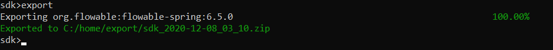

In case you need to export only a particular component use commands `export cuba-addon`/`export jmix-addon`, `export cuba`/`export jmix` or `export lib`.

3. Finally, find the archive in the `<home>/export` directory and transfer it to the required environment.

## How to Import Artifacts

We assume that we have an exported archive with the required artifacts. A computer we need to import the archive on is in an isolated network and have no access to the internet. To install CUBA SDK you need to transfer an installation file to the computer.

First, you need to organize a local repository. Follow the instructions in the [How to Organize Local Repository](#how-to-organize-local-repository). 

When CUBA SDK is installed and the local repository is configured run the `import` command and specify the path to the archive.

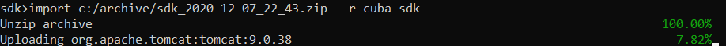


# Build information

## How to build, run, and debug CUBA SDK locally (in Intellij IDEA) <a name="how-to-build-cuba-sdk"></a>

Below, `${platform}` is referred to as the current Operating System (OS) name (`windows`, `linux`, `macos` for Windows, 
Linux, and macOS respectively).

The build directory of the CUBA SDK project contains a script file (`.bat` for Windows or `.sh` for Linux/macOS under 
`bundle-${platform}/bin`). Besides, there are two more directories inside: `native-${platform}` with a necessary Java 
runtime image created with the use of jlink and `plugins` with some `.jar` files (including archives corresponding to all 
the project modules). In order to generate a working build, one needs to run the Gradle task 
`.\gradlew bundle` (here, Gradle Wrapper is used from the project root location). It is possible (but not mandatory) to 
add `-PtargetOsPlatform=${platform}` as a command line parameter. It is
worth noticing that this task (among other things) copies the content of one of the two files from `etc` directory
(located in the same `cuba-sdk` module) to the script file created for a new build. Of course, the choice of the file is
determined by the current OS (picked up as the `rootProject.targetOsPlatform` property value).

Once the task is completed, it is enough to execute `cuba-sdk.bat` or `cuba-sdk.sh` in Terminal to **run** the build. If **debugging**
is required, one must set `JLINK_VM_OPTIONS = -agentlib:jdwp=transport=dt_socket,server=y,suspend=y,address=*:5005` and
run the standard Remote JVM Debug configuration of Intellij IDEA to connect to the running JVM.

